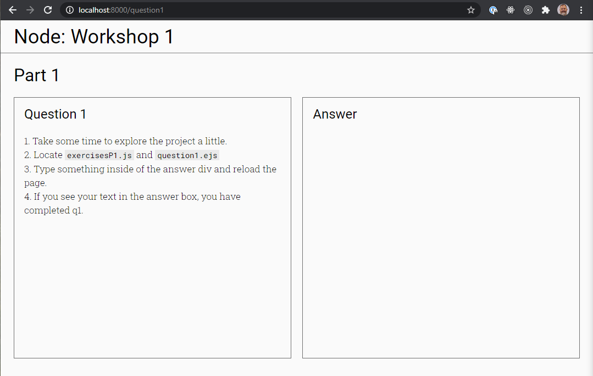

# 3.2 Node.Js: EJS

## Setup

1. Install the [EJS language support](https://marketplace.visualstudio.com/items?itemName=DigitalBrainstem.javascript-ejs-support) extension for VS Code.
2. Open a terminal window and type `yarn install`
3. Start up the server by typing `yarn dev`

Your node application is now running at http://localhost:8000

## Deeper Dive into this app

### Required dependencies

If you look in the `package.json` file you will see all of the external dependencies, or modules, that we will need for today's workshop.

| package                                          | Description                                                                                                                                                       |
| ------------------------------------------------ | ----------------------------------------------------------------------------------------------------------------------------------------------------------------- |
| [express](https://www.npmjs.com/package/express) | Fast, unopinionated, minimalist web framework for node.                                                                                                           |
| [nodemon](https://www.npmjs.com/package/nodemon) | nodemon is a tool that helps develop node.js based applications by automatically restarting the node application when file changes in the directory are detected. |
| [morgan](https://www.npmjs.com/package/morgan)   | HTTP request logger middleware for node.js                                                                                                                        |
| [ejs](https://www.npmjs.com/package/ejs)         | Embedded JavaScript templates.                                                                                                                                    |
| [moment](https://www.npmjs.com/package/moment)   | A lightweight JavaScript date library for parsing, validating, manipulating, and formatting dates.                                                                |

### File Structure

```
├── __solution
├── __workshop
|   ├── exercisesP1.js
|   └── ...
├── data (data files used to complete exercises)
|   ├── dataFiles.js
|   └── dataFiles2.js
├── node_modules (where all external dependencies are saved)
|   ├── ...
|   └── ...
├── public (folder that serves static files)
|   ├── styles.css
|   └── static.html
├── views (location of all the ejs template files)
│   ├── pages
│   │   ├── homepage.ejs
│   │   └── exercises
|   |       ├── q1.ejs
|   |       └── ...
│   └── partials
│       ├── head.ejs
│       ├── header.ejs
│       └── ...
├── .gitignore
├── package.json (where we keep a record app setup)
├── README.md (this file)
├── server.js
└── yarn.lock ("locks" the dependency versions)
```

## EJS Syntax

- `<%` 'Scriptlet' tag, for control-flow, no output
- `<%=` Outputs the value into the template (HTML escaped)
- `<%-` Outputs the unescaped value into the template
- `<%#` Comment tag, no execution, no output
- `%>` Plain ending tag

#### 📝 Note

- When you run `yarn install`, yarn reads the `package.json` and downloads the dependencies in the `node_modules` folder. It will also generate a `yarn.lock` file if it doesn't already exist; if it does exist, it will defer to the version numbers in that file, rather than taking the most recent version available remotely. This is to ensure compatibility and prevent _breaking_ changes in dependencies from, well, breaking our app.
- `ejs` files are basically supercharged `html` files. We can pass in JavaScript values. It allows us to do TONS of cool stuff. 😀
- Use the `styles.css` to add some zing to your exercises.

---

## The Workshop

### Where are the questions?

This workshop is a little "meta". The workshop contains a UI for the tutorial. As go through the questions, you will actually work on the UI of the tutorial and improve the app. You will find all of the questions can be found at the `/question<#>` endpoints in the browser.

e.g. Question 1 is located at `https://localhost:8000/question1`. Type that in the browser. The question should appear!



### How do I answer the questions?

You will need to use two files to answer most of the questions.

You will write all data-manipulating JS in the `exercisesP1.js` file for questions 1 to 5, and when applicable, the HTML output in the `..views/pages/question<#>.ejs` file.

## Note

The solution folder contains solutions but none that can be run. They are technically outside of the app. You can locate the file you are working on and compare with your solution.

## Completion Grid

| 75% Minimum | 100% Complete | Stretch     |
| ----------- | ------------- | ----------- |
| `Question9` | `Question10`  | _see below_ |

### Stretch Goal(s)

- Are there any other optimizations that you could make?
- Create a new endpoint. `/bacon` where the visitor can see an inspiring message from you.
- Take a look at the [EJS Docs](https://ejs.co/#docs/)
- If you feel so inclined, add some CSS to create a better looking tutorial. Who knows, the next cohort might use your design. 😉
